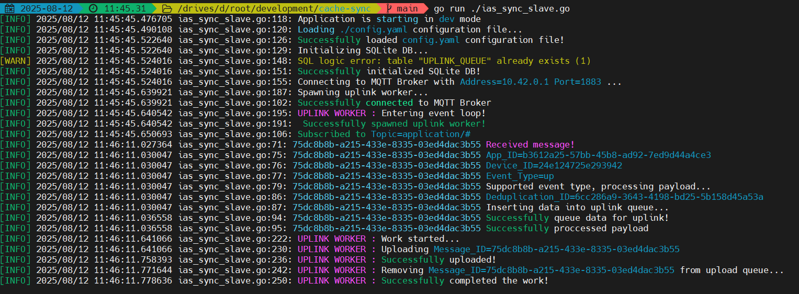

# 📒 cache-sync

Offline-First MQTT Data Caching for __*IAS*__ IIOT Reliability

---

## ✏️About

__*cache-sync*__ ensures zero data loss for your IIOT end-nodes by locally caching MQTT telemetry to an embedded SQLite database when internet connectivity is unavailable. Designed to guarentee __*IAS platform*__ data reliability, it asynchronously uploads cached data to __*IAS platform*__ server upon reconnection with unlimited retries, configurable queue sizes, and upload frequency controls.

Built for harsh environments: A lightweight, multithreaded Go service that guarantees data integrity where connectivity is unreliable.

## 🔑Key Features

- ✅ MQTT to SQLite Buffering – Listen to  end-node topics, cache data locally.
 
- ✅ Resilient Sync Engine – Automatic retries, configurable batch uploads.

- ✅ Thread-Safe & Low-Overhead – Multithreaded Go backend for high efficiency.

- ✅ Plug-and-Play for __*IAS*__ first-party hardware – Seamlessly extends your IIOT platform’s reliability

- ✅ Multi-Architecture Support – Runs on x86, x64, and ARM (Raspberry Pi, edge devices).

## 🖥️Screenshots

## 💽Binaries?

Head over to __*GitHub Actions*__ tab & open the last successfull workflow run. There should be where the pre-compiled binaries are located.

Binaries are only available for these platforms :
 - Linux
    - arm64/aarch64
    - amd64/x64

## 📜License

__*cache-sync*__ is maintained by [haziqnorisham](https://github.com/haziqnorisham) for [Camart Sdn. Bhd.](https://camartcctv.com)

__*cache-sync*__ is licensed under the GNU Affero General Public License v3.0 (AGPLv3).
Key Points for Users:

- ✅ Freedom to Use, Modify, and Distribute – Provided you preserve license terms and disclose source code.

- 📜 Copyleft Requirement – Any derivative work or networked service using __*cache-sync*__ must also be open-sourced under AGPLv3.

- 🔗 Full License Text – See LICENSE file in this repository or read AGPLv3 on GNU.org.

---